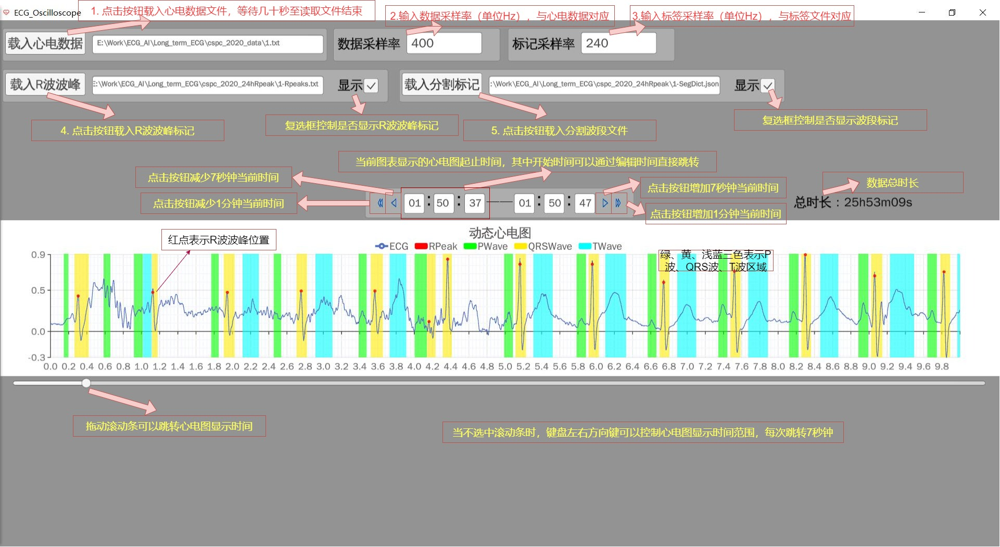

# ECG Oscilloscope

一款单导联心电图信号及分割分类标签可视化工具，支持长时心电图的快速浏览与波段标记查看。基于游戏引擎Unity及图表可视化库XCharts实现，支持Windows系统下使用。

功能描述：

1. 单导联心电图信号可视化

2. R波波峰标记可视化

3. P波、QRS波、T波波段标记可视化

4. 分类结果可视化（TODO）

## 运行环境

Windows

## 依赖库

Unity 2021.3.16f1

[XCharts](https://github.com/XCharts-Team/XCharts) 3.5

[Newtonsoft.Json](https://github.com/JamesNK/Newtonsoft.Json)

## 软件下载

从github/release下载软件，解压后双击ECG_Oscilloscope.exe启动软件。

## 使用说明



## 数据格式约定

### 心电数据文件

以逗号分隔数值的文本文件，扩展名为txt，数值单位为毫伏mV，文件中不能出现空格和换行。

### R波波峰标记文件

首先是文件名，随后是以逗号分隔整数的文本文件，扩展名为txt，每个整数表示在标记对应采样率下第几个采样点为R波波峰，文件中不能出现空格和换行。

1.txt,48,248,448,648,847,1047

### 分割波段标记文件

json格式文件，内含一个字典，如下所示格式：
其中"R on"、"R off"两个列表表示一个QRS波区间的起止位置，该位置用在标记对应采样率下第几个采样点来表示，P
波和T波以此类推。区间起止点必须成对出现，即同一波段on和off列表长度必须相等。

```json
{
    "R on": [39, 239, 438, 638],
    "R off": [62, 263, 463, 662, 861],
    "P on": [208, 408, 608, 808, 1009, 1209],
    "P off": [228, 427, 625, 825, 1024, 1226],
    "T on": [85, 287, 485, 684, 884],
    "T off": [129, 342, 532, 733, 929],
}
```

### 分类标记文件

TODO

## 历史版本

### v0.2

- 调整布局，基准分辨率从1920x1080修改为1920x996
- 优化心电数据文件载入的时间和空间效率
- 新增标记分割修改项功能，实现分割修改标记的显示、导入导出、增删改、定位等功能

### v0.1 2023年1月3日

- 实现单导联心电图信号可视化

- 实现R波波峰标记可视化

- 实现P波、QRS波、T波波段标记可视化

- 支持滚动条、键盘左右方向键、导航按钮按钮导航方式
