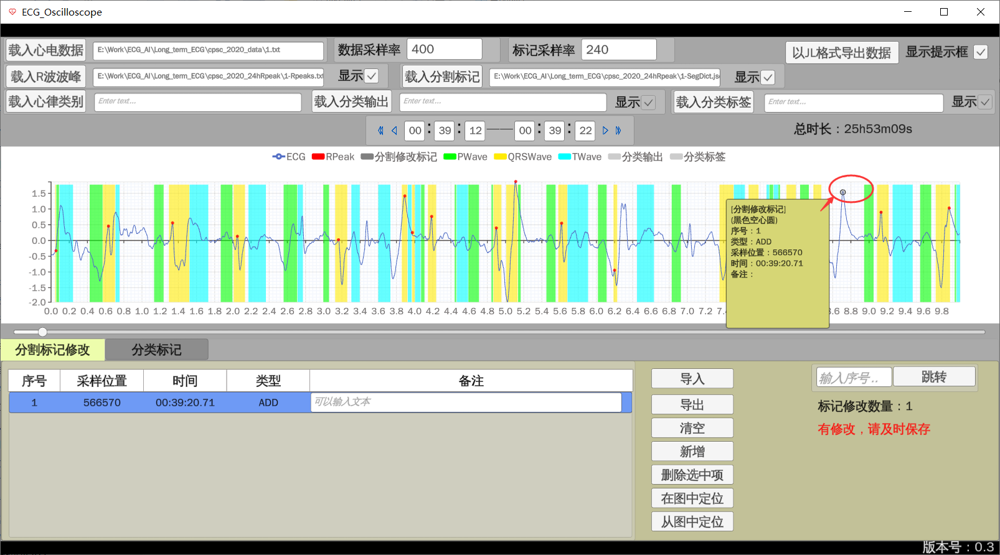

# ECG Oscilloscope

一款单导联心电图信号及分割分类标签可视化工具，支持长时心电图的快速浏览与波段标记查看和修改标记。基于游戏引擎Unity及图表可视化库XCharts实现，支持Windows系统下使用。

功能描述：

1. 单导联心电图信号可视化

2. R波波峰标记可视化

3. 支持纪录R波波峰标记错标和漏标的位置

4. P波、QRS波、T波波段标记可视化

5. 分类输出结果可视化

6. 支持分类复核功能，对分类输出结果错误心拍进行复核

7. 分类标签可视化

## 运行环境

Windows

## 依赖库

Unity 2021.3.16f1

[XCharts](https://github.com/XCharts-Team/XCharts) 3.5

[Newtonsoft.Json](https://github.com/JamesNK/Newtonsoft.Json)

## 软件下载

从github/release下载软件，解压后双击ECG_Oscilloscope.exe启动软件。

## 使用说明


**0.2版本开始，当鼠标悬停在某个组件时，会弹出提示框对组件功能进行说明，请通过此功能查看使用说明。**



另外，鼠标放在心电图分割修改标记项位置时（黑色空心圆），会显示该修改标记项信息。


分类标记上面的数字表示对应表中的序号。

## 数据格式约定

### 心电数据文件

以逗号分隔数值的文本文件，扩展名为txt，数值单位为毫伏mV，文件中不能出现空格和换行。

### R波波峰标记文件

首先是文件名，随后是以逗号分隔整数的文本文件，扩展名为txt，每个整数表示在标记对应采样率下第几个采样点为R波波峰，文件中不能出现空格和换行。

1.txt,48,248,448,648,847,1047

### 分割波段标记文件

json格式文件，内含一个字典，如下所示格式：
其中"R on"、"R off"两个列表表示一个QRS波区间的起止位置，该位置用在标记对应采样率下第几个采样点来表示，P
波和T波以此类推。区间起止点必须成对出现，即同一波段on和off列表长度必须相等。

```json
{
    "R on": [39, 239, 438, 638],
    "R off": [62, 263, 463, 662, 861],
    "P on": [208, 408, 608, 808, 1009, 1209],
    "P off": [228, 427, 625, 825, 1024, 1226],
    "T on": [85, 287, 485, 684, 884],
    "T off": [129, 342, 532, 733, 929],
}
```

### 分割修改标记文件

json格式文件，内含一个数组，数组的每个元素包含一个字典，该字典表示一个分割修改项，如下所示格式：

**timeIndex**表示采样位置，即在标记对应采样率下第几个采样点；

**type**表示修改类型，包含如下三种：

ADD: 此处应增添一个R波；

REMOVE: 此处应删除一个R波；

OTHER: 其他情况，在备注中有说明；

**note**表示备注，对修改项进行说明。

注：timeIndex按时间升序排列

```json
[
    {
        "timeIndex": 20616605,
        "type": "ADD",
        "note": ""
    },
    {
        "timeIndex": 20616745,
        "type": "REMOVE",
        "note": ""
    },
    {
        "timeIndex": 20616881,
        "type": "OTHER",
        "note": "此处需要找医生核对"
    },
]
```

### 心律类别文件

UTF-8编码的txt文本文件，每行一个心律类型，表示模型输出都可能有哪些类别。

```
窦性心律
房性早搏
心房扑动
心房颤动
室性早搏
阵发性室上性心动过速
心室预激
室扑室颤
房室传导阻滞
噪声
```

### 分类输出文件

UTF-8编码的txt文本文件，每一行代表一个心拍分类模型输出结果，每行由三个英文逗号隔开，可看作每行四列的csv逗号分隔符表格文件（只是扩展名为txt）。

第一列为QRS中点的采样位置，即QRS中点在标记对应采样率下第几个采样点；

第二列为R波波峰的采样位置，当该值为-1时，表示该心拍没有识别到R波；

第三列为模型的分类输出结果，是心律类别文件中包含的某个心律类别，**当该项为空时该工具会忽略这个心拍**；

第四列表示该心拍是否是分割模型没有识别到的心拍通过其他策略补充的，为True时第二列为-1，为False时，第二列为正常值。

```
50,48,,False
251,248,窦性心律,False
450,448,窦性心律,False
650,648,心室预激,False
849,847,心室预激,False
1049,1047,心室预激,False
1250,1248,窦性心律,False
1449,1447,窦性心律,False
```

### 分类标签文件

UTF-8编码的txt文本文件，每一行代表一个心拍分类的标签，由一个逗号隔开，可看作每行两列的csv逗号分隔符表格文件（只是扩展名为txt）。

第一列为分类标签的采样位置，即=在标记对应采样率下第几个采样点；

第二列为分类标签，该位置是那种心律类型。

```
242188,室上性早搏
1175711,室上性早搏
1213011,室上性早搏
1829974,室上性早搏
2061858,室上性早搏
2206051,室上性早搏
2206429,室上性早搏
2344734,室上性早搏
2348264,室上性早搏
2461555,室上性早搏
3377119,室上性早搏
4486261,室上性早搏
```

### 分类输出结果复核文件

json格式文件，内含一个字典，字典的每个键值对表示一个分类输出结果的复核信息，如下所示格式：

键：分类输出文件中的某个QRS中点采样位置，为字符串格式

值：一个字典，表示该QRS中点所示心拍的复核信息

**timeIndex**分类输出文件中的某个QRS中点采样位置，整型格式；

**newArrythmia**该心拍的复核结果类别，当该项为空字符串时表示还未复核。

**note**表示备注，对复核项进行说明。

```json
{
    "849": {
        "timeIndex": 849,
        "newArrythmia": "",
        "note": ""
    },
    "1846": {
        "timeIndex": 1846,
        "newArrythmia": "",
        "note": ""
    },
    "2632": {
        "timeIndex": 2632,
        "newArrythmia": "",
        "note": ""
    }
}
```

## 历史版本

### v0.3 2023年2月22日

1. 实现分类输出的可视化

2. 实现分类复核功能，支持标记分类复核项和复核结果

3. 实现分类标签的可视化

4. 实现分辨率自适应，修复UI在一些分辨率下无法显示全的bug

5. 性能优化，每帧更新图表改为按需更新图标

6. 调整UI布局，增大显示面积

7. 支持将当前所示心电图导出为JL格式

### v0.2.1 2023年2月2日

1. 修复Tooltip在不同分辨率下定位bug

### v0.2 2023年1月31日

1. 调整布局，基准分辨率从1920x1080修改为1920x996
2. 优化心电数据文件载入的时间和空间效率
3. 新增标记分割修改项功能，实现分割修改标记的显示、导入导出、增删改、定位等功能
4. 新增鼠标悬停在组件上弹出提示框功能
5. 新增鼠标悬停在分割修改标记处弹出提示框显示相应信息功能

### v0.1 2023年1月3日

1. 实现单导联心电图信号可视化

2. 实现R波波峰标记可视化

3. 实现P波、QRS波、T波波段标记可视化

4. 支持滚动条、键盘左右方向键、导航按钮按钮导航方式
